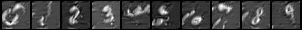

# CS772 Project: Zero-Shot Machine Unlearning

## Overview
The project involved understanding and building upon the paper [Zero-shot Machine Unlearning](https://arxiv.org/abs/2201.05629). The paper introduces two methods for tackling Machine Unlearning in a classification setting where there is no access to data. The **Error Minimisation Maximisation Noise** method optimises noise matrices using the model to resemble data to be forgotten and retained. The **Gated Knowledge Tranfer** approach utilises the model to genereate representative samples and utilises these, filtering out the classes to be forgotten, to train a new model.

We propose two improvements over the existing GKT method. Firstly we employ an additional entropy-based filter for avoiding low quality samples. This helps us to achieve comparative performance with significantly reduced re-training time. 

   
  Variation of Retain Accuracy with Entropy Threshold

Secondly we replace the generator with [Deep Inversion](https://arxiv.org/pdf/1912.08795) to generate samples closes to better resemble the actual training data. This helps us to generate data which is much more interpretable. Following is for the MNIST digits dataset.

   
  GKT samples

   
  GKT with Deep Inversion samples

## Code
  - `Deep Inversion.ipynb`: Generating images of MNIST numbers from the trained model using Deep Inversion.
  - `GKT + Entropy Criterion.ipynb`: Implementing the entropy criteria for filtering generated data points.
  - `GKT + No Attention.ipynb`: Removing Attention from student loss.
  - `GKT + Deep Inversion.ipynb`: Using Deep Inversion as the generator in GKT.

## Project Video Presentation

   
  

## Project Team
- Ashutosh [@ashutoshkr4458](https://github.com/ashutoshkr4458)
- Labajyoti [@labajyoti21](https://github.com/labajyoti21)
- Krish [@flintmarko](https://github.com/flintmarko)
- Shubham [@SP1029](https://github.com/SP1029)
- Siddharth [@sid-kal](https://github.com/sid-kal)

## Code References
- https://github.com/ayushkumartarun/zero-shot-unlearning
- https://github.com/NVlabs/DeepInversion/tree/master
